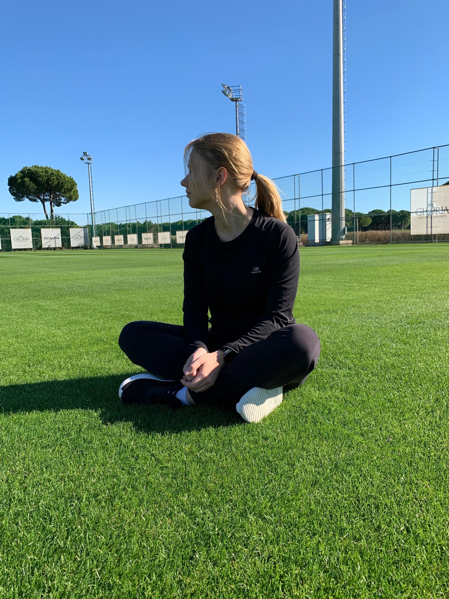

<h1> Hi there 👋, My name is Angelina </h1>
<h2> I am freelance Middle Flutter developer </h2>

  

 

<h3>About me</h3>
  👱‍♀️ 3 yrs of Flutter experience
  📱 1 yr of iOS/Swift  
  🧗 20+ projects on Flutter  
  📙 Uncle Bob fan  
  📖 Constantly learning new  

<h3>I prefer working with:</h3>
✔️ riverpod  
  ✔️ go router  
  ✔️ auto router  
  ✔️ freezed  
  ✔️ json serializable  
  ✔️ mockito / mocktail  
  ✔️ clean architecture  

🔭 I am focused on creating high-quality apps that would bring more profit to the business but would also be inexpensive

<h3>Skills</h3>
FLUTTER / DART / FIREBASE / RIVERPOD / BLOC / SOLID / JS / HTML / CSS

<h3>Help info</h3>
❓ Ask me about anything related to mobile development. I'd be glad to help! 
✉️ How to reach me: tg @pandaMob
📬 You can also mail me: <a href="mailto:mobilepandasstudio@gmail.com">mobilepandasstudio@gmail.com</a> 
 
 

      

